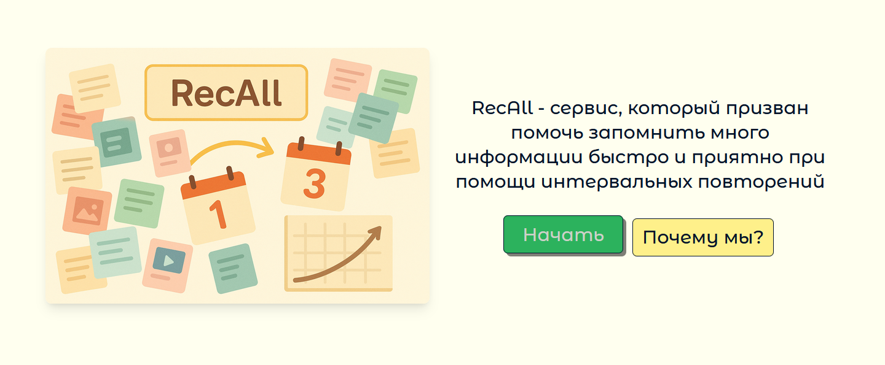
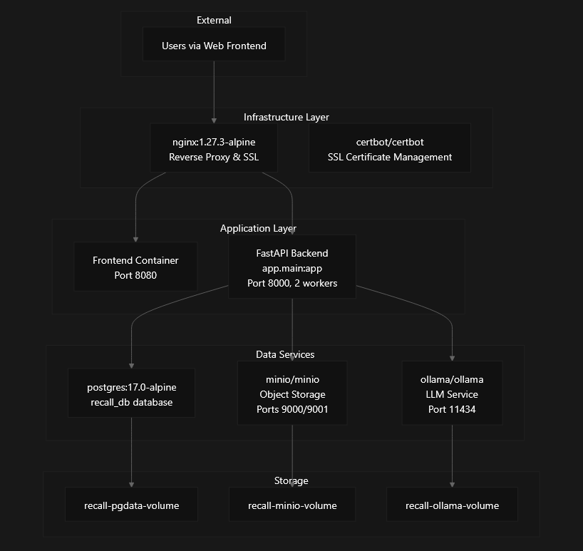
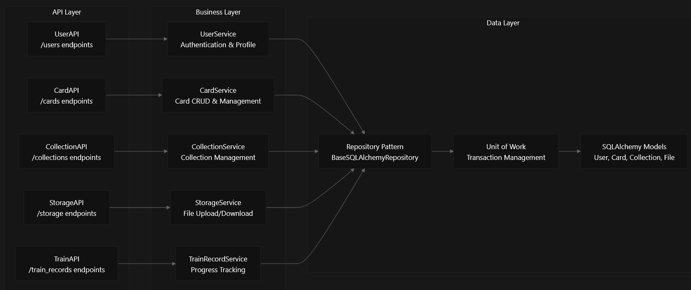
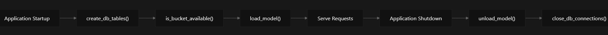

## RecAll Backend Overview

## Purpose and Scope

This document provides a high-level introduction to the RecALL backend system, a FastAPI-based flashcard and spaced repetition learning platform. It covers the system's purpose, key features, architectural approach, and core components. For detailed information about specific subsystems, see [Deployment](docs/configuration-environment-setup.md), [Application Architecture](docs/architecture.md), [Core Domain Models](docs/core-domain-models.md), and [API Reference](docs/api-reference.md).

## System Description

RecALL is a web-based learning platform backend that implements flashcard-style studying with spaced repetition algorithms and AI-powered feedback. The system enables users to create flashcards, organize them into collections, attach files, and track learning progress through scientifically-backed spaced repetition techniques.

The platform supports both private learning and public content sharing, allowing users to create personal study materials or contribute to a shared knowledge base. AI integration via Ollama provides intelligent feedback and scoring during study sessions.

## Key Features

| Feature Category | Capabilities |
| --- | --- |
| **User Management** | Registration, authentication, profile management |
| **Content Creation** | Flashcard creation with front/back sides, rich text support |
| **Organization** | Collections to group related cards, public/private visibility |
| **File Attachments** | Upload and attach images/documents to cards via MinIO storage |
| **Learning System** | Spaced repetition algorithm, progress tracking, training records |
| **AI Integration** | Automated feedback and scoring via Ollama LLM service |
| **Content Sharing** | Public collections and cards for community learning |
| **Multi-tenancy** | User-owned content with proper access controls |

## Architecture Overview

The system follows a microservices architecture deployed via Docker Compose, with clear separation between presentation, business logic, and data layers. The application implements repository and service layer patterns for clean code organization.

### High-Level System Architecture

### Application Request Flow

## Technology Stack

The system is built on modern Python web technologies with a focus on type safety, performance, and maintainability:

| Component | Technology | Purpose |
| --- | --- | --- |
| **Web Framework** | [**FastAPI**](https://fastapi.tiangolo.com) | High-performance async API framework with automatic OpenAPI docs |
| **Database ORM** | [SQLAlchemy](https://https://www.sqlalchemy.org/) | Python SQL toolkit and ORM for database interactions |
| **Data Validation** | [Pydantic](https://docs.pydantic.dev) | Data validation and settings management used by FastAPI |
| **Database** | [PostgreSQL 17.0](https://www.postgresql.org) | Primary relational database for application data |
| **Object Storage** | [MinIO](https://min.io/docs/minio/linux/operations/installation.html) | S3-compatible storage for file attachments |
| **Containerization** | [Docker Engine + Docker Compose](https://docs.docker.com/engine/install/) | Multi-service deployment orchestration |
| **Package Management** | [Poetry](https://python-poetry.org/docs/#installation) | Python dependency management and packaging |
| **Web Server** | Nginx | Reverse proxy with SSL termination |
| **AI/ML** | Ollama | Local LLM server for AI feedback (llama3.1, mistral) |

## System Components

### Core Services

The application runs as multiple Docker containers with specific responsibilities:

| Service | Container | Purpose |
| --- | --- | --- |
| **nginx** | `recall-nginx` | SSL termination, reverse proxy, static file serving |
| **backend** | `recall-backend` | FastAPI application, business logic, API endpoints |
| **frontend** | `recall-frontend` | Web UI application |
| **postgres** | `recall-postgres` | Primary database for user data, cards, collections |
| **minio** | `recall-minio` | Object storage for file attachments |
| **ollama** | `recall-ollama` | LLM service for AI feedback |

### Application Lifecycle

The FastAPI application implements comprehensive lifecycle management in `app/main.py`:

1.  **Startup**: Creates database tables, verifies MinIO bucket availability, loads AI model
2.  **Runtime**: Serves API requests with CORS middleware for cross-origin requests
3.  **Shutdown**: Unloads AI model, closes database connections

## How to deploy or start the service

For detailed information, see [Configration and Environment Setup](docs/configuration-environment-setup.md).

## Deployment Model

The system is designed for production deployment with the following characteristics:

-   **Multi-container Architecture**: Each service runs in its own container with resource limits
-   **SSL/TLS Security**: Automatic certificate management via Let's Encrypt and Certbot
-   **High Availability**: Health checks and restart policies for service reliability
-   **Data Persistence**: Named volumes for database, object storage, and AI model data
-   **Network Isolation**: Internal Docker network for service communication

The system serves production traffic at `letsrecall.ru` with CORS configured for the domain and local development endpoints.
