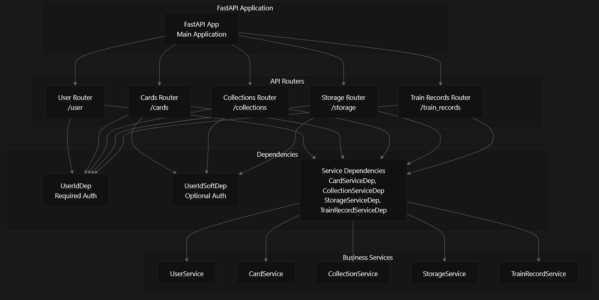
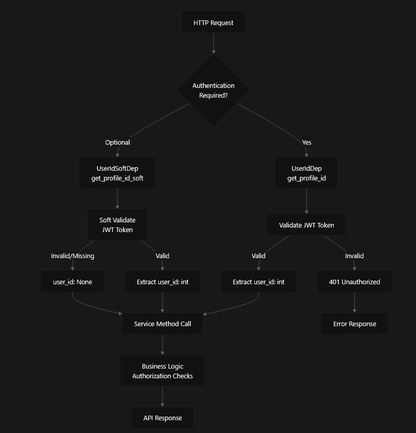

# API Reference

This document provides a complete reference for all REST API endpoints in the RecALL backend application. The API is built using FastAPI and provides endpoints for user management, flashcard operations, collections, file storage, and training functionality.

## API Architecture Overview

The API is organized into modular routers, each handling a specific domain of functionality. All routers use dependency injection for service access and authentication.



The API uses a two-tier authentication system with required and optional authentication dependencies.



## Common Request Patterns

### Dependency Injection Pattern

All API endpoints follow a consistent dependency injection pattern for services and authentication:

| Dependency | Type                 | Purpose | Usage |
| --- |----------------------| --- | --- |
| `UserIdDep` | `int`                | Required authentication | Creates, updates, deletes |
| `UserIdSoftDep` | `int \| None`        | Optional authentication | Public reads with ownership context |
| `CardServiceDep` | `CardService`        | Card business logic | Card-related operations |
| `CollectionServiceDep` | `CollectionService`  | Collection business logic | Collection-related operations |
| `StorageServiceDep` | `StorageService`     | File storage operations | File upload/download |
| `TrainRecordServiceDep` | `TrainRecordService` | Training progress | Learning analytics |

### Request Body Patterns

#### Bulk Operations

For operations involving multiple IDs, the API uses `IntListBody` constraint:

```python
IntListBody = Annotated[list[int], Body(min_length=1, max_length=100)]
```

This pattern is used in endpoints like card creation with collection assignments.

## API Response Formats

### Standard Data Models

All API responses use Pydantic models for consistent data serialization:

| Model | Usage | Key Fields |
| --- | --- | --- |
| `Card` | Card data responses | `id`, `front_side`, `back_side`, `is_public`, `owner_id` |
| `Collection` | Collection data responses | `id`, `title`, `description`, `is_public`, `owner_id` |
| `CollectionShort` | Collection list responses | Excludes `description` field |
| `FileMeta` | File metadata responses | `id`, `filename`, `type`, `ext`, `is_public` |

### Special Response Types

#### File Downloads

File download endpoints return `StreamingResponse` with appropriate headers:

```python
StreamingResponse(
    file.stream,
    media_type="application/octet-stream", 
    headers={
        "Content-Disposition": f"attachment; filename={quote(file.metadata.filename)}",
        "Content-Type": f"{file.metadata.type}/{file.metadata.ext}"
    }
)
```

#### Deletion Operations

Delete operations return `Response` class with status code 204 (No Content).

## Error Handling

The API follows FastAPI's standard error handling with HTTP status codes:

-   `401 Unauthorized` - Invalid or missing authentication
-   `403 Forbidden` - User lacks permission for the resource
-   `404 Not Found` - Resource does not exist
-   `422 Unprocessable Entity` - Invalid request data
-   `500 Internal Server Error` - Server-side errors

Authorization is handled at the service layer, allowing for consistent business logic across all endpoints.

## Endpoint Categories

### Core Resource Operations

| Router | Prefix | Primary Resources | Authentication |
| --- | --- | --- | --- |
| Cards | `/cards` | Flashcards, card-collection associations | Required for CUD, optional for reads |
| Collections | `/collections` | Collections, card organization | Required for CUD, optional for reads |
| Storage | `/storage` | File upload/download, metadata | Required for uploads/deletes, optional for downloads |
| User | `/user` | Registration, login, profiles | Mixed requirements |
| Train Records | `/train_records` | Learning progress, training sessions | Required |

### Cross-Resource Relationships

The API supports complex relationships between resources:

-   Cards can belong to multiple collections
-   Cards can have multiple file attachments
-   Collections have training modes for spaced repetition
-   Files inherit visibility from associated cards
-   Training records track progress across cards
