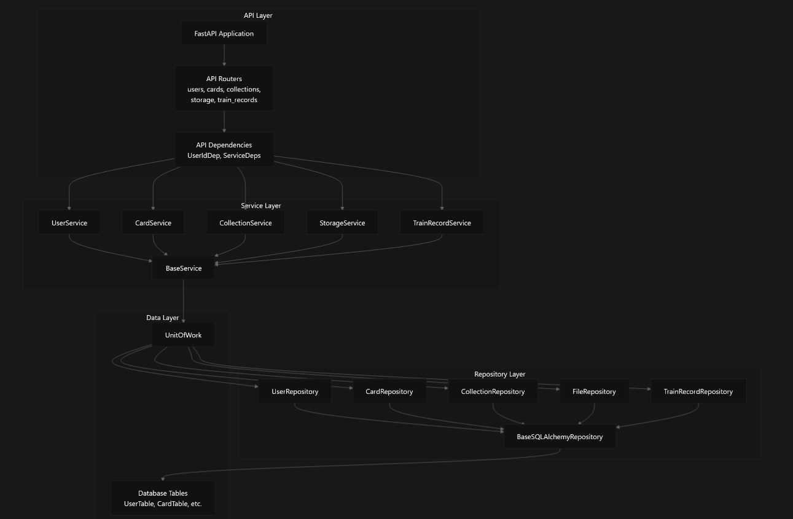
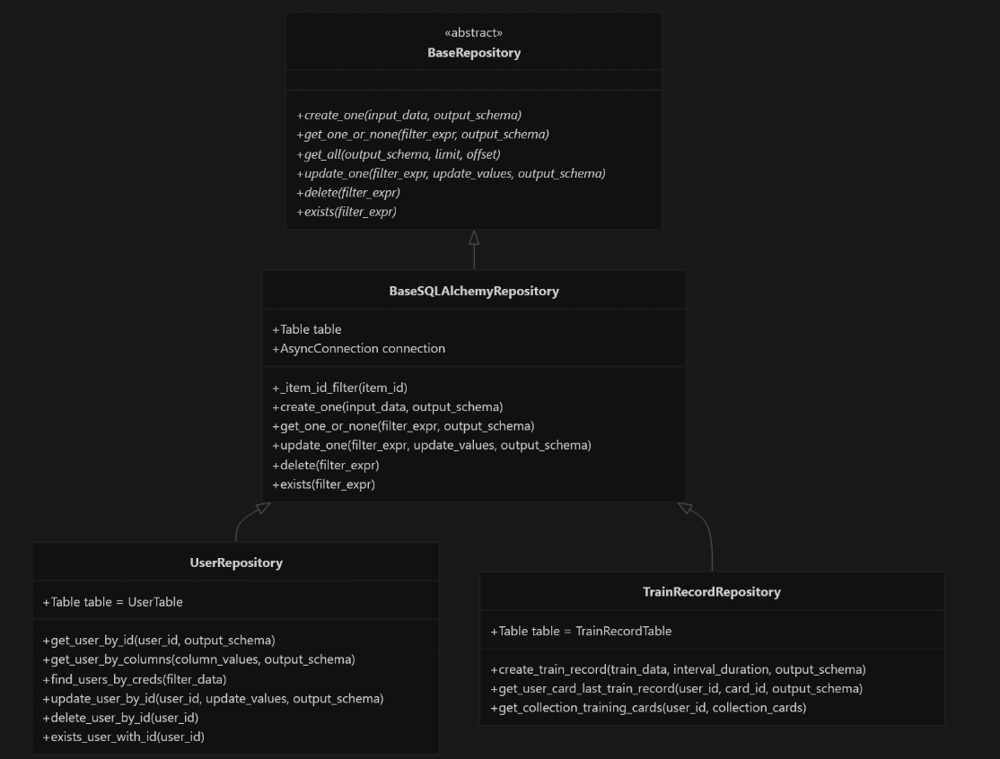
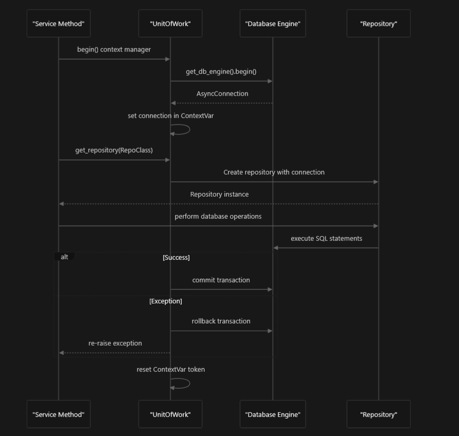
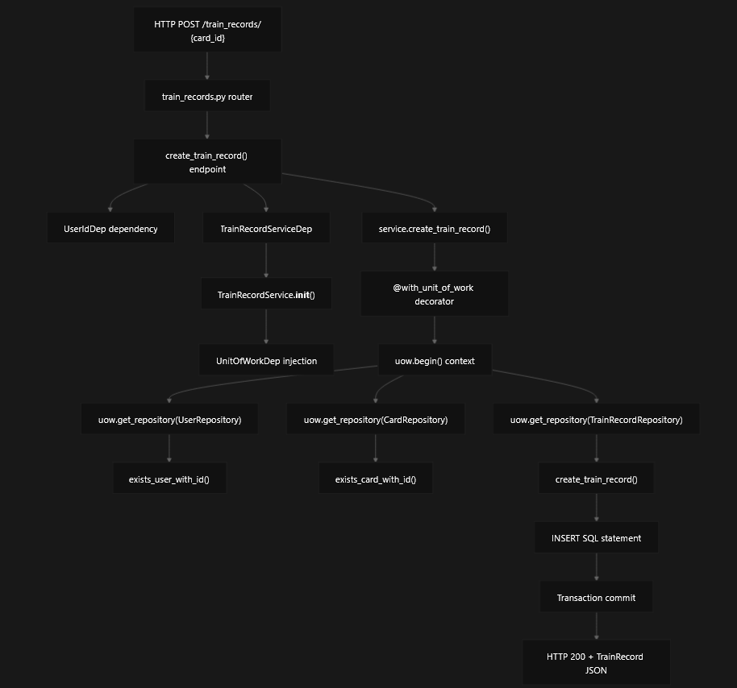

# Application Architecture

This document explains the overall code organization, layered architecture patterns, and key design decisions used in the recall-back FastAPI application. It covers the structural foundation that supports the flashcard learning platform, including dependency injection, transaction management, and separation of concerns across different architectural layers.

## Architecture Overview

The recall-back application follows a clean layered architecture pattern with clear separation between API handling, business logic, and data access. The architecture is built around FastAPI and uses modern Python patterns including dependency injection, repository pattern, and unit of work for transaction management.

### High-Level Architecture Diagram

## Application Initialization and Lifecycle

The FastAPI application uses a lifespan context manager to handle startup and shutdown operations. This includes database table creation, external service validation, and AI model management.

The application initialization occurs in `app/main.py` within the `lifespan` async context manager. The startup sequence ensures all required external dependencies are available before the application becomes ready to serve requests.

## Layered Architecture Pattern

### API Layer

The API layer consists of FastAPI routers that handle HTTP requests and responses. Each domain area has its own router module:

| Router Module | Prefix | Purpose |
| --- | --- | --- |
| `users.py` | `/users` | User management operations |
| `cards.py` | `/cards` | Card CRUD operations |
| `collections.py` | `/collections` | Collection management |
| `storage.py` | `/storage` | File upload/download |
| `train_records.py` | `/train_records` | Training session tracking |

All routers are automatically registered through the `all_routers` list in `app/api/__init__.py` and included in the FastAPI application via `app/main.py`

### Service Layer

The service layer encapsulates business logic and coordinates between the API and repository layers. All services inherit from `BaseService` which provides unit of work dependency injection.

The `@with_unit_of_work` decorator in `app/services/base.py` ensures that service methods execute within database transactions managed by the Unit of Work pattern.

### Repository Layer

The repository layer provides data access abstraction through the repository pattern. `BaseSQLAlchemyRepository` implements common CRUD operations that are inherited by domain-specific repositories.

Each repository class sets a `table` class variable to specify which database table it operates on, as seen in `app/repositories/user.py` and `app/repositories/train_record.py`.

## Unit of Work Pattern

The `UnitOfWork` class implements transaction management using SQLAlchemy's async connection handling. It ensures that multiple repository operations can be executed within a single database transaction.

### Unit of Work Transaction Flow

The connection is stored in a `ContextVar` at `app/db/unit_of_work.py` to maintain transaction isolation across async operations. Repository instances are created on-demand through `get_repository()`.

## Request Processing Flow

A typical API request flows through all architectural layers, with dependency injection managing the creation and coordination of components.

### Complete Request Flow Example

This flow demonstrates how a training record creation request at `app/api/train_records.py` flows through the service method at `app/services/train_record.py` and ultimately executes database operations through repositories.

## Key Architectural Benefits

### Separation of Concerns

Each layer has a distinct responsibility:

-   **API Layer**: HTTP protocol handling, request validation, response formatting
-   **Service Layer**: Business logic, workflow orchestration, cross-cutting concerns
-   **Repository Layer**: Data access, query optimization, database abstraction
-   **Data Layer**: Transaction management, connection pooling

### Testability

The dependency injection pattern and interface-based design make the application highly testable. Services can be tested with mock repositories, and repositories can be tested with test databases.

### Maintainability

Clear architectural boundaries make it easy to modify individual components without affecting others. Adding new endpoints requires only implementing the corresponding service methods and repository operations.
