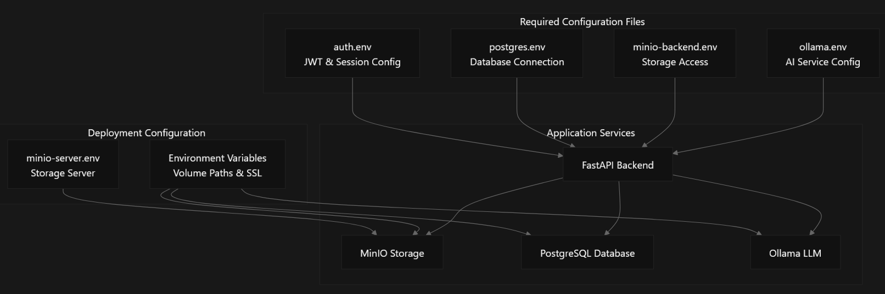
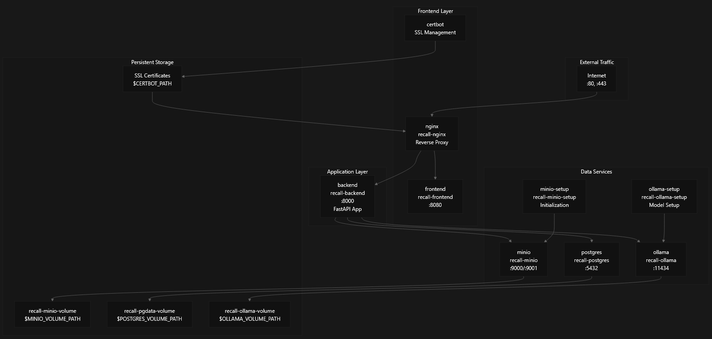
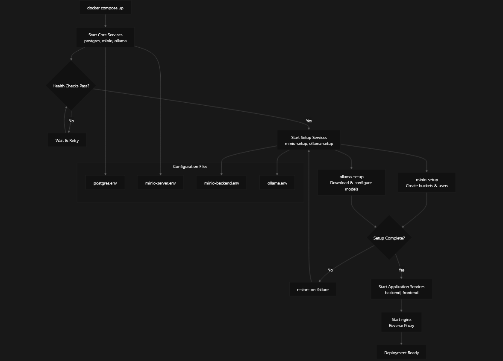

# Configration and Environment Setup 

This document covers the environment configuration, dependency management, and setup procedures for the recall-back application. It details the required configuration files, environment variables, and setup processes for both local development and Docker deployment scenarios.

## Environment Configuration Files

The application requires several environment configuration files located in the `config/` directory. These files configure authentication, database connections, object storage, and AI services.

### Core Configuration Files

#### Authentication Configuration

The `auth.env` file configures JWT authentication and session management:

```config
SECRET_KEY=<secret_key_for_encrypting>
ALGORITHM=<encrypting_algorithm: e.g. HS256>
ACCESS_TOKEN_KEY=<title_of_cookie_token_attribute>
EXPIRE_HOURS=12
HTTPONLY=true
SECURE=true
SAMESITE=strict # or lax or none
```

#### Database Configuration

The `postgres.env` file configures PostgreSQL database connections:

```
POSTGRES_USER=<backend_postgres_user_login>
POSTGRES_PASSWORD=<backend_postgres_user_passwrod>
POSTGRES_HOST=<postgres_addr>
POSTGRES_HOST_PORT=<postgres_port>
POSTGRES_DB=<postgres_db_name>
```

#### Object Storage Configuration

The `minio-backend.env` file configures MinIO S3-compatible storage for the backend:

```
MINIO_HOSTNAME=<minio_addr> # IP address - without protocol
MINIO_PORT=<minio_port>
MINIO_BUCKET_NAME=<bucket_name>
MINIO_LOGIN=<backend_minio_user_login>
MINIO_PASSWORD=<backend_minio_user_password>
MINIO_MAX_FILE_MB_SIZE=<mb_integer_number>
```

#### AI Service Configuration

The `ollama.env` file configures the Ollama LLM service:

```
OLLAMA_FROM_MODEL=<basic_model> # now allowed llama3.1 and mistral
OLLAMA_HOSTNAME=<ollama_addr> # IP address - without protocol
OLLAMA_PORT=<port>
OLLAMA_MODEL=<name_for_modified_model>
```

### Deployment-Specific Configuration

For Docker deployment, additional configuration files are required:

#### MinIO Server Configuration

The `minio-server.env` file configures MinIO server settings:

```
MINIO_ROOT_USER="<root_user_login>"
MINIO_ROOT_PASSWORD="<root_user_passwrod>"
MINIO_VOLUMES="/mnt/minio-volume"
MINIO_OPTS="--console-address :9001"
```

#### Environment Variables for Docker Compose

The following environment variables must be set for Docker deployment:

| Variable | Purpose | Example |
| --- | --- | --- |
| `CERTBOT_PATH` | SSL certificates directory | `/etc/letsencrypt` |
| `RECALL_FRONTEND_PATH` | Frontend source code path | `/path/to/recall-front` |
| `MINIO_VOLUME_PATH` | MinIO storage directory | `/data/minio` |
| `POSTGRES_VOLUME_PATH` | PostgreSQL data directory | `/data/postgres` |
| `OLLAMA_VOLUME_PATH` | Ollama models directory | `/data/ollama` |

**Configuration File Structure**



## Python Dependencies and Poetry Setup

The application uses Poetry for Python dependency management and virtual environment handling.

### Core Dependencies

The project requires Python 3.11+ and uses these primary dependencies:

| Package | Version | Purpose |
| --- | --- | --- |
| `fastapi[standard]` | ^0.115.3 | Web framework with standard features |
| `sqlalchemy` | ^2.0.36 | Database ORM |
| `asyncpg` | ^0.30.0 | Async PostgreSQL driver |
| `pydantic-settings` | ^2.6.1 | Configuration management |
| `python-jose` | ^3.3.0 | JWT token handling |
| `bcrypt` | ^4.2.0 | Password hashing |
| `ollama` | ^0.4.7 | AI/LLM integration |
| `miniopy-async` | ^1.22.1 | Async MinIO client |

### Poetry Installation and Setup

For detailed information, see our [Poetry configuration Wiki Guide](https://github.com/FIT-2024-RecALL/recall-back/wiki/Poetry).


### Development Environment Setup

1.  **Create and activate virtual environment:**

```bash
cd <path_to_the_project>
poetry shell
```

2.  **Install dependencies:**

```bash
poetry install
```

3.  **Verify installation:**

```bash
poetry show  # List installed packages
```

**Dependency Management Flow**


## Local Development Setup

Local development setup enables running the FastAPI application directly without Docker for faster development cycles.

### Prerequisites

1.  **Poetry installed** (see previous section)
2.  **PostgreSQL running locally** or accessible remotely
3.  **MinIO server running** (optional for file operations)
4.  **Ollama service running** (optional for AI features)

### Environment Configuration

1.  **Create configuration directory:**

```bash
mkdir config
```

2.  **Create required environment files** as described in the Environment Configuration Files section
    
3.  **Ensure external services are accessible** with the hostnames and ports specified in the configuration files
    

### Running the Application

The application can be started using several methods:

**Development mode with hot reload:**

```bash
fastapi dev app/main.py
```

**Production-style execution:**

```bash
uvicorn app.main:app --<your_flags>
```

## Docker Deployment Configuration

Docker deployment uses `compose.yaml` to orchestrate multiple services including the web server, application, database, storage, and AI services.

### Service Architecture

The Docker Compose configuration defines these services:

| Service | Container | Purpose | Dependencies |
| --- | --- | --- | --- |
| `nginx` | `recall-nginx` | Reverse proxy & SSL | `frontend`, `backend` |
| `backend` | `recall-backend` | FastAPI application | `postgres`, `minio` |
| `frontend` | `recall-frontend` | Frontend application | None |
| `postgres` | `recall-postgres` | PostgreSQL database | None |
| `minio` | `recall-minio` | Object storage server | None |
| `ollama` | `recall-ollama` | LLM service | None |

### Network and Volume Configuration

**Network Setup:**

-   All services use the `dev` network for internal communication
-   External access through nginx on ports 80/443

**Volume Mounting:**

```yaml
volumes:
  recall-minio-volume:
    driver_opts:
      type: none
      o: bind
      device: $MINIO_VOLUME_PATH
  recall-pgdata-volume:
    driver_opts:
      type: none
      o: bind
      device: $POSTGRES_VOLUME_PATH
  recall-ollama-volume:
    driver_opts:
      type: none
      o: bind
      device: $OLLAMA_VOLUME_PATH
```

### Deployment Process

1.  **Prepare environment variables:**

```bash
export CERTBOT_PATH=/path/to/certificates
export RECALL_FRONTEND_PATH=/path/to/frontend
export MINIO_VOLUME_PATH=/path/to/minio/storage
export POSTGRES_VOLUME_PATH=/path/to/postgres/data
export OLLAMA_VOLUME_PATH=/path/to/ollama/models
```

Either wrote `.env` file inside project directory with described variables

2.  **Create configuration files** in `config/` directory
    
3.  **Build and start services:**
    

```bash
docker compose up --build
```

4.  **SSL certificate setup (if needed):**

```bash
# Initial certificate creation
docker compose run --rm certbot certonly --webroot --webroot-path /var/www/certbot/ -d <domain.addr>

# Certificate renewal
docker compose run --rm certbot renew
```

**Docker Service Dependencies**



## Service-Specific Configuration

Each service in the deployment stack requires specific configuration for optimal operation.

### Backend Service Configuration

The backend service uses these key configuration aspects:

**Health Dependencies:**

-   Waits for PostgreSQL health check: `pg_isready -U backend -d recall_db`
-   Waits for MinIO health check: `curl -f http://localhost:9000/minio/health/live`

### PostgreSQL Configuration

**Health Check:**

```yaml
healthcheck:
  test: "pg_isready -U backend -d recall_db"
  interval: 3s
  timeout: 3s
  start_period: 5s
  retries: 5
```

**Environment:** Configured via `postgres.env` file

### MinIO Configuration

**Server Setup:**

-   Console address: `:9001`
-   API address: `:9000`
-   Configuration loaded from `minio-server.env`

**Backend Access:**

-   Configured via `minio-backend.env`
-   Setup script: `minio-setup.sh`

### Ollama Configuration

**Model Management:**

-   Custom model setup via `ollama-setup` container
-   Base models: `llama3.1`, `mistral`
-   Custom model naming via `OLLAMA_MODEL` environment variable

**Service Initialization Flow**


