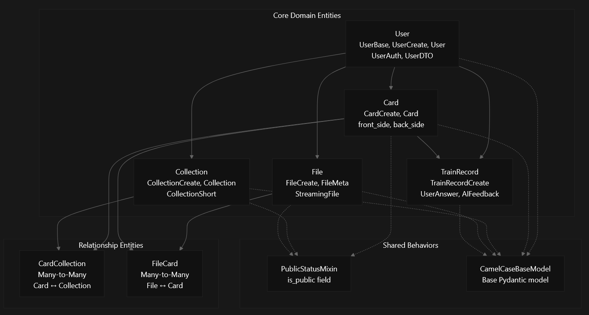
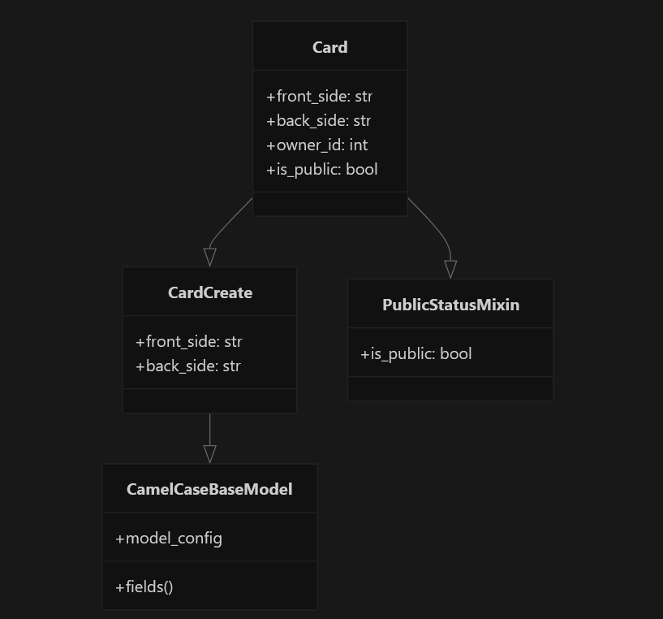
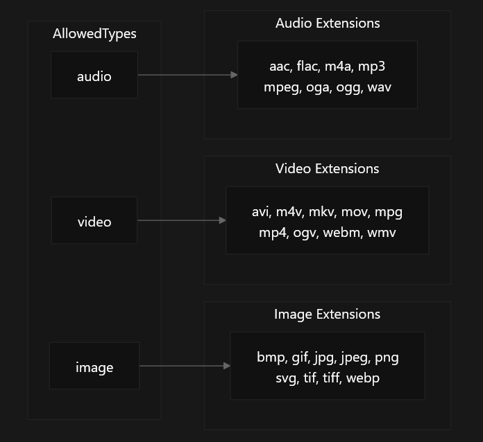
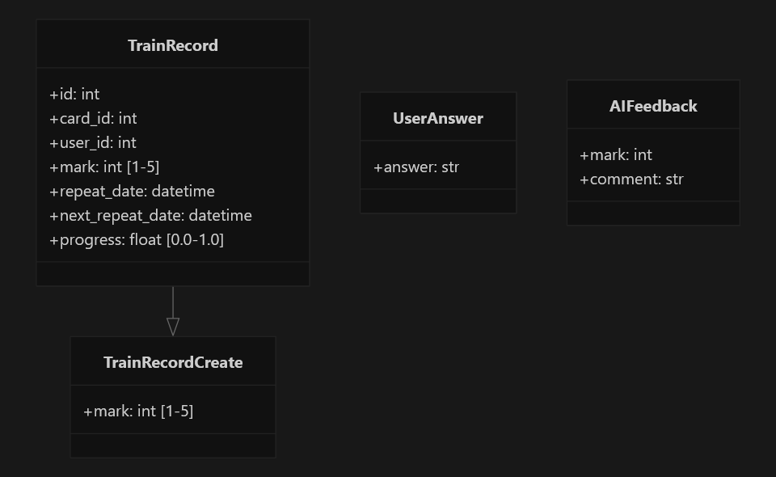
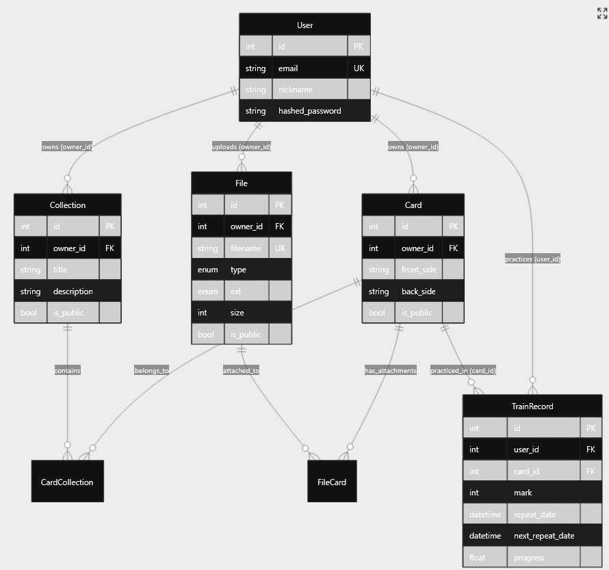

# Core Domain Models

This document describes the core business entities and data structures that form the foundation of the recall-back learning platform. These models represent the primary concepts users interact with: users, flashcards, collections, files, and training progress.

The domain models are implemented as Pydantic schemas for API serialization/validation and SQLAlchemy tables for database persistence.

## Core Entity Overview

The recall-back platform is built around five primary domain entities that work together to enable spaced repetition learning:

## User Domain Model

The `User` entity represents platform users and handles authentication, profiles, and ownership relationships. Users own all other content in the system.

### User Schema Hierarchy

| Schema Class | Purpose | Key Fields |
| --- | --- | --- |
| `UserBase` | Common user fields | `nickname`, `email` |
| `UserCreate` | User registration | Extends `UserBase` + `password` |
| `User` | Public user representation | Extends `UserBase` + `id` |
| `UserAuth` | Login credentials | `email`, `password` |
| `UserDTO` | Data transfer object | All fields optional, handles `hashed_password` alias |

### Key Implementation Details

-   Email validation using `EmailStr` from Pydantic.
-   Nickname length constraints: 1-35 characters.
-   Password length constraints: 8-40 characters.
-   `UserDTO` provides flexible field mapping with `hashed_password` alias `app/schemas/user.py`

## Card Domain Model

The `Card` entity represents individual flashcards with front and back content. Cards are the primary learning unit in the spaced repetition system.

### Card Schema Structure

### Card Business Rules

-   Both `front_side` and `back_side` require minimum length of 1 character.
-   Cards inherit public/private visibility through `PublicStatusMixin`.
-   Every card has an `owner_id` linking to the creating user.
-   Cards can be associated with multiple collections through `CardCollection` relationship.
-   Cards can have multiple file attachments through `FileCard` relationship.

## Collection Domain Model

The `Collection` entity groups related cards together and manages their collective visibility and organization.

### Collection Schema Variants

| Schema Class | Purpose | Fields |
| --- | --- | --- |
| `CollectionCreate` | Creating new collections | `title`, `description` |
| `Collection` | Full collection data | Extends `CollectionCreate` + `owner_id` + `is_public` |
| `CollectionShort` | Minimal collection info | `owner_id`, `title`, `is_public` |

### Collection Features

-   Title length constraints: 1-100 characters.
-   Optional description field.
-   Public/private visibility inheritance to contained cards
-   Owner-based access control through `owner_id`.

## File Storage Domain Model

The `File` entity manages multimedia attachments that can be associated with cards, supporting images, videos, and audio files.

### File Type System

The file system enforces strict type and extension validation:

### File Schema Structure

-   `FileCreate`: Core file metadata with `owner_id`, `filename`, `type`, `ext`, `size`.
-   `FileMeta`: Extends `FileCreate` with `PublicStatusMixin` for visibility control.
-   `StreamingFile`: Special model for file transfer with metadata and `FileStream`.

### File Business Rules

-   Supported types defined by `AllowedTypes` literal.
-   Supported extensions defined by `AllowedExts` literal.
-   File visibility cascades from associated cards' public status
-   Unique filename constraint in database.

## Training and Progress Domain Model

The `TrainRecord` entity implements the spaced repetition algorithm by tracking user progress on individual cards.

### Training Schema Components

### Spaced Repetition Implementation

-   `mark`: User performance rating from 1-5.
-   `progress`: Learning progress as float between 0.0-1.0
-   `repeat_date`: When the training session occurred.
-   `next_repeat_date`: When card should be reviewed next.
-   `UserAnswer`: Captures user's text response for AI evaluation.
-   `AIFeedback`: AI-generated score and feedback.

## Entity Relationships and Data Flow

The domain models form a cohesive system where users create and organize content for spaced repetition learning:

### Visibility and Access Control

The platform implements a sophisticated public/private visibility system:

1.  **User-owned content**: All entities (except `TrainRecord`) have an `owner_id` linking to the creating user
2.  **Public/private flag**: Cards, Collections, and Files inherit from `PublicStatusMixin` providing `is_public` boolean
3.  **Cascading visibility**: When a collection becomes public, its cards may also become visible; when cards become public, their attached files may also become visible
4.  **Training privacy**: `TrainRecord` entities are always private to the practicing user
